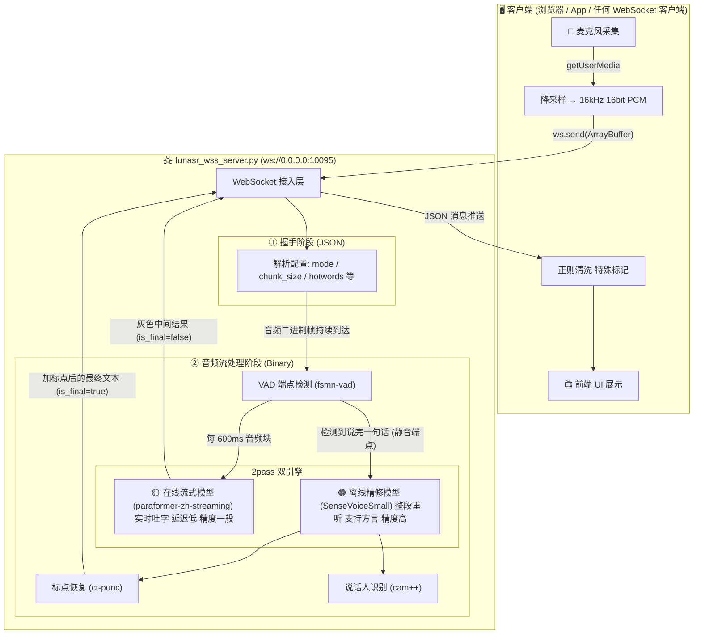

# FunASR 实时语音转写服务 — 系统架构与工作流程

## 一、接入方式

**目前仅支持 WebSocket 协议**（`ws://0.0.0.0:10095`），客户端需使用 `"binary"` 子协议握手。

---

## 二、整体架构流程图



---

## 三、核心工作时序图

```mermaid
sequenceDiagram
    participant C as 客户端
    participant S as WebSocket 服务端
    participant VAD as VAD 端点检测
    participant ON as 在线模型 (Streaming)
    participant OFF as 离线模型 (SenseVoice)
    participant P as 标点恢复

    C->>S: 1. WebSocket 握手 (子协议 binary)
    C->>S: 2. JSON 配置 mode 2pass hotwords等
    
    loop 用户持续说话
        C->>S: 3. 二进制 PCM 音频帧 (每 256ms)
        S->>VAD: 喂入音频
        VAD->>ON: 转发音频块
        ON-->>C: 灰色实时文字 is_final false
    end
    
    Note over VAD: 检测到静音 断句
    VAD->>OFF: 整段完整音频
    OFF->>P: 识别原文
    P-->>C: 黑色最终文字 is_final true
    
    C->>S: 4. is_speaking false 结束信号
    Note over S: 强制输出最后一句
```

---

## 四、五个模型各司其职

| 模型 | 名称 | 作用 | 触发时机 |
|------|------|------|----------|
| **VAD** | fsmn-vad | 语音端点检测，判断"这句话说完了没" | 始终运行，每帧都在判断 |
| **在线 ASR** | paraformer-zh-streaming | 实时流式吐字，给用户"正在听"的反馈 | 每收到 600ms 音频就跑一次 |
| **离线 ASR** | SenseVoiceSmall | 高精度识别，支持方言和多语种 | VAD 检测到断句后，拿整段音频跑一次 |
| **标点恢复** | ct-punc | 给离线 ASR 的纯文本补上标点符号 | 离线 ASR 出结果后立刻执行 |
| **说话人识别** | cam++ | 判断"谁在说话" | 离线 ASR 出结果后立刻执行 |

---

## 五、一句话的完整生命周期

以用户说 **"我今朝站着有点真舒服的好像有点感冒样"**（带方言口音）为例：

1. **麦克风采集** → 浏览器 `getUserMedia` 拿到原始音频
2. **降采样** → `AudioContext(sampleRate:16000)` 转成 16kHz 16bit PCM
3. **WebSocket 发送** → 每 4096 采样点打包成 `ArrayBuffer` 发给服务端
4. **VAD 持续监听** → 发现用户在说话，开始攒音频
5. **在线模型实时吐字** → 前端显示灰色字：`"那要早早"` / `"早一点点舒舒服哥好像一点子"` （在线模型不懂方言，瞎猜的）
6. **VAD 检测到停顿** → 判定这句话说完了，把整段音频交给离线模型
7. **SenseVoiceSmall 重新识别** → 输出 `"<|zh|><|NEUTRAL|><|Speech|><|woitn|>我今朝站着，有点真舒服的，好像有点感冒样"`
8. **标点恢复** → 补上逗号
9. **WebSocket 回传** → `{text: "...", is_final: true}` 推给前端
10. **前端清洗** → 正则去掉 `<|...|>` 标记，最终显示黑色字：**"我今朝站着，有点真舒服的，好像有点感冒样"**
